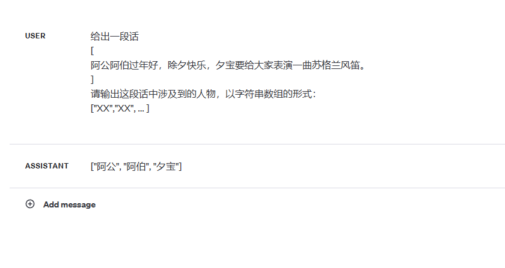

请提取下面这段话中的人物
[
阿公阿伯过年好，除夕快乐，夕小姐要给大家表演一曲苏格兰风笛。
]
请判断 "年小姐","夕小姐","风笛小姐","阿先生" 是否出现在这个场景中。

一些例子：

“我家的阿姨一年三百块。” 中的“阿”不指代人物, 返回false。
“你和你的种族令我感到可笑。”中的“令”不指代人物，返回false。
“夕宝是我的老婆。”中的“夕”指代人物，返回true。

请注意考虑常见的变体比如X宝，X先生等。

我的请求内容是：
[
大哥大嫂过年好，除夕快乐，干员年要给大家表演一曲苏格兰风笛。
]

请将结果以Json的格式输出，格式如下
[
    {"char":"年","is_character":true/false},
    {"char":"夕","is_character":true/false},
    {"char":"风笛","is_character":true/false},
    {"char":"阿","is_character":true/false}
]

