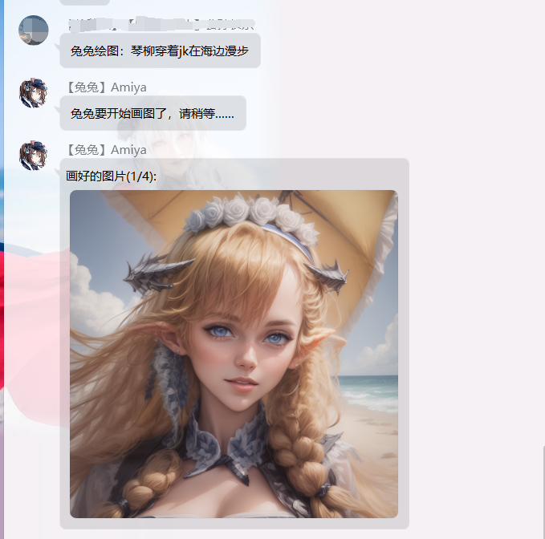
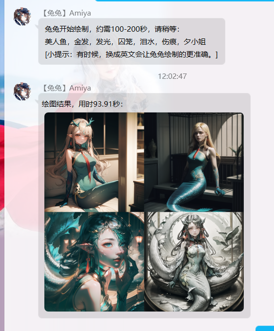

# Stable Diffusion + ChatGPT

提供一个StableDiffusion WebUI的兔兔接口。

> 💡 **提示**：使用本功能前，请确保你已经在本地部署了StableDiffuion。不清楚如何部署？推荐参考B站大佬秋叶akki的教程。

**有一些必要WebUI的插件需要安装，他们都列在最下面的必要插件章节中**

**<span style="color:green;">要想使用本功能，你必须要 1. 对如何使用StableDiffuion有了解, 能够使用SD进行绘图和修图等操作. 2. 拥有一个ChatGPT的API Key. 3. 网络环境可以访问ChatGPT, Civitai网站. 4. 安装我的另一个ChatGPT插件（可不设置为启用）并配置API Key</span>**

**<span style="color:red;">在开始之前，请一定要先从头到尾读完本说明。</span>**

## 绘图命令

每个群内用户，可以使用`兔兔绘图：琴柳穿着jk在海边漫步`这样的关键词来进行绘画，兔兔会稍后在群内回复画好的图片，效果如下：




命令必须以`兔兔绘图：`开头，注意兔兔不可以换成任意其他唤醒词。此外，还可以在消息的结尾使用 -ar 16:9 -hr -lr 来指定分辨率和输出高分辨率，低分辨率图形。

## 安装要求

**<span style="color:red;">1. 兔兔版本大于6.3.9</span>**
**<span style="color:red;">2. 已经部署且可运行的StableDiffusionWebUI</span>**
**<span style="color:red;">3. 可以连接Civitai和OpenAI的网络连接</span>**

## 安装与配置

刚装好插件后，插件什么都做不了，你需要跟着下面这几步去执行初始化配置。

### 配置webui地址

* 打开您的webui。
* 滚动至页面最下方，点击API链接。


* 将新页面的地址复制，并粘贴至Docs Url配置项。

> 注：本插件暂不支持WebUI登录认证，你的WebUI地址必须可以匿名访问。WebUI自带的认证功能会在未来版本支持。如果你使用其他互联网服务商提供的网络部署服务，并且拥有独特的认证方式，请到GitHub提交Issue申请支持。

### 等待连接

稍等30秒，如果WebUI可以连接，你会在兔兔日志中看到诸如下面这样的提示信息。

```log

2023-10-10 12:47:13,844 [StableDiffusion][     INFO] 因docs变化而重载WebUIApi...
2023-10-10 12:47:13,918 [StableDiffusion][     INFO] WebUIApi刷新完毕...

```

此时已经连上了WebUI Api，可以开始后续步骤了。

### 模型选择

* 刷新兔兔Console，在本插件设置中，进入‘模型选择’配置项。
* 根据需要配置模型和相应的prompt。
* 模型选择主要的作用是针对预定义的风格，选择底模和配置一些默认的参数

**工作原理**：

1. **图像生成**： 
   - 当用户发言时，兔兔会生成四张图像。
   - 这实际上是ChatGPT的Prompt会尝试理解用户的输出，然后给出四段danboru tag。

2. **Tag 类型**：
   - 生成的这四段tag会被标记为以下几种类型之一

   - SDXL标准Style类型：
     - "Anime" - 动画
     - "Manga" - 漫画
     - "Photographic" - 照片
     - "Isometric" - 微距
     - "Low_Poly" - 低分辨率
     - "Line_Art" - 素描
     - "3D_Model" - 3D模型
     - "Pixel_Art" - 像素风
     - "Watercolor" - 水彩

   - 还包括我自定义的类型：
     - "Chibi" - Q版

3. **模型配置**：
   - 如果您为某个类型配置了一个或多个模型，那么该tag的底模就从对应的配置项中随机一个。
   - 系统会自动将对应的prompt拼接到这段tag的最后，并使用配置的参数。
   - 如果您没有为某个类型定义模型，而ChatGPT生成了一个对应的tag，则将使用`默认模型`配置项中的模型。
   - 如果您为每种类型都提供了至少一个模型，那么`默认模型`实际上不会被调用。

### 添加Lora

好了，现在，兔兔已经可以开始接受用户的输入来画图了，但是作为明日方舟bot，总要有点特色。

管理员私聊兔兔并发送`兔兔下载Lora`。

兔兔就会在‘Lora下载到’配置的那个目录创建两个文件夹：lora和embeddings。如果配置项为空，默认位置是resources\stable-diffusion。然后，兔兔会去civitai上，按照Arknights作为关键词搜索模型,然后自动挑选并下载干员的lora,并放在这两个文件夹下。

等他下载完，你需要将lora和embeddings分别拷贝到SD的对应目录或子目录。
兔兔在做这件事时，会同时保存lora的文件名和提示词，因此你不可以对lora或者embeddings改名。

然后，当兔兔检测到用户绘图指令提到了方舟的干员，他会自动拼接Lora和Embeddings进prompt中。

在resources\stable-diffusion\lora-download-log.txt文件中,你可以看到下载的详情日志.

## 必要插件

ADetailer，为了保证出图质量，指令默认用ADetailer进行了后处理，不安装ADetailer会报错。

`ADetailer的下载地址是（需要补充文档）`

## 开箱即用

* 你可能注意到了，本项目自带的默认配置文件并不是一个空白配置文件。
* 默认配置文件的内容，就是我正在使用的配置内容。
* 默认配置文件中含有我挑选的几个优质底模和画风Lora，他们在能够提供优质画面的同时，还能不过分影响角色Lora。
* 在positive和negitive prompt中，还含有几个优化lora。
* 这些lora都来自civitai，他们的列表如下：

* 底模（Checkpoints）
   - QteaMix
   - OrangeMix
   - RevAnimated
   - DreamShaper
   - GhostMix
* 风格Lora
   - [Anime Lineart / Manga-like (线稿/線画/マンガ風/漫画风) Style](https://civitai.com/models/16014/anime-lineart-manga-like-style)
   - [Lineart——照片线稿提取](https://civitai.com/models/94355/lineart)
   - [Miniature world style 微缩世界风格](https://civitai.com/models/28531/miniature-world-style)
   - [M_Pixel 像素人人](https://civitai.com/models/44960/mpixel)
   - [沁彩 Colorwater](https://civitai.com/models/16055/colorwater)
   - [【Art Style】ChiChi Style](https://civitai.com/models/22992/art-stylechichi-style)
   - [Akagi Shun Style LoRA](https://civitai.com/models/46813/akagi-shun-style-lora)

* 你可以选择将他们都下载下来，这样就可以直接使用我的配置文件。
* 如果你想自己调教，你也可以自己挑选模型和配置。**<span style="color:red;">但是请检查一遍配置，将使用了你没有的底模的配置项删掉，不然兔兔会报错。</span>**

## 版权声明

SD WebUI 使用AGPL版权。AGPL是一个强限制的开源协议，访问任何使用AGPL协议的网络服务的代码也需要开源。因此，本项目同样遵循AGPL版权。

## TODO

- 完善文档，这篇文档写的非常简略，对于没有StableDiffusion经验的人来说可能会比较困难，同时还缺少一些步骤的截图和Civitai的链接地址。如果您有兴趣帮忙修改文档，您可以直接在Github想我提出PR。

## 备注

* 插件图标是使用StableDiffusion生成的。

## 相关链接

[项目地址:Github](https://github.com/hsyhhssyy/amiyabot-hsyhhssyy-stable-diffusion/)

[遇到问题可以在这里反馈(Github)](https://github.com/hsyhhssyy/amiyabot-hsyhhssyy-stable-diffusion/issues/new/)

|  版本   | 变更  |
|  ----  | ----  |
| 1.0  | 最初的版本 |

## 下面就是兔兔画廊时间了

## TODO List

兔兔在出图的同时给出prompt

兔兔对四张图的其中一张做hi-res

兔兔用ip adapter图生图和混合图生图

